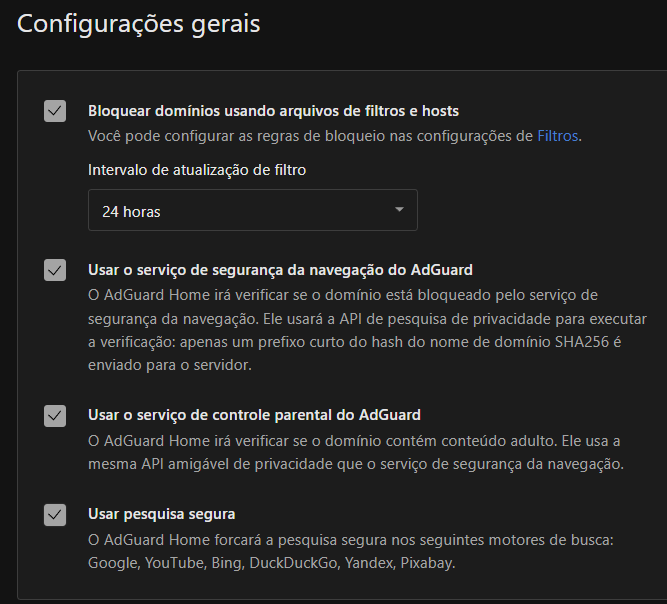
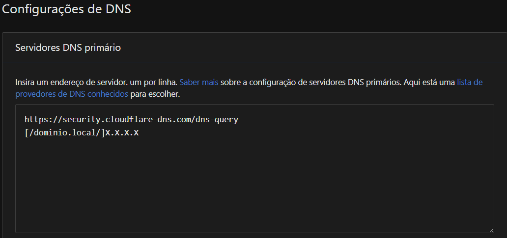
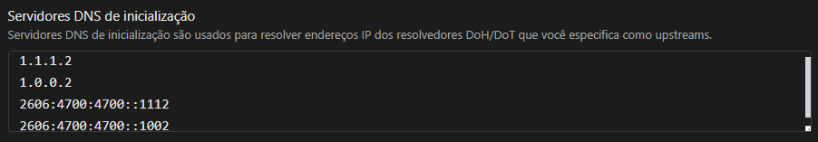
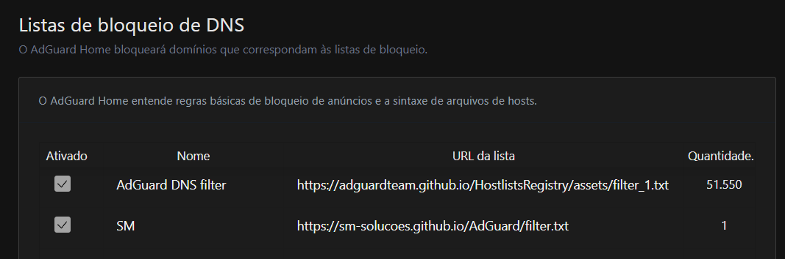

# AdGuard

<code>https://security.cloudflare-dns.com/dns-query</code>

<code>
  1.1.1.2
  1.0.0.2
  2606:4700:4700::1112
  2606:4700:4700::1002
</code>

URL: https://sm-solucoes.github.io/AdGuard/filter.txt
